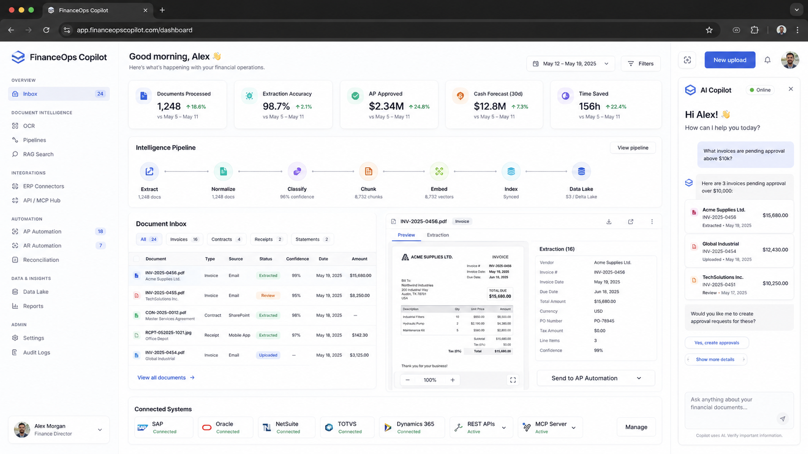

# Results — FinanceOps Copilot

---

## Case 1 — Finance Department Automation (sanitized)

**Profile:** Finance/controllership team running an ERP as the system of record for AP/AR, the general ledger, and invoices, with internal approval and close policies maintained as documents.

**Pain:**
- Every finance data question required a human to log in to the ERP and dig
- AP invoices waited in inboxes for manual approval, even when clearly within policy
- Reconciliation only started when someone remembered to start it
- Cloud AI tools were off-limits for confidential financial data

**Results (dashboard KPIs):**

| KPI | Value |
|---|---|
| Invoices & documents processed | ~1,248 |
| Extraction accuracy | 96.7% |
| AP approved within policy | $2.34M |
| Cash position forecast | $12.8M |
| Hours saved (per month) | 156 |

> The connector targets shown reflect the product's integration surface; this showcase does not assert a specific production deployment for any individual ERP.

---

## Aggregate Metrics

> *Figures mirror the product dashboard and are illustrative showcase values (synthetic data), not audited client numbers.*

```
Invoices & documents processed:  ~1,248    ████████████████░░░░
Extraction accuracy:             96.7%      ███████████████████░
AP approved within policy:       $2.34M     ██████████████░░░░░░
Cash position forecast:          $12.8M     ████████████████████
Hours saved per month:           156        ███████████░░░░░░░░░
```

---

## Screenshots

> The image below is a product screenshot for visual demonstration — no real client data is exposed.


